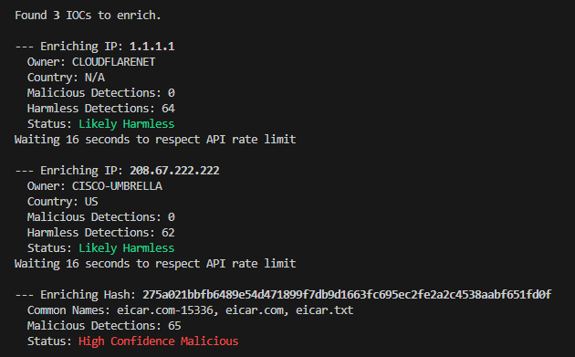

## Python Threat Intelligence Enrichment Tool

This command-line tool automates the process of enriching security indicators of compromise (IOCs) by querying the VirusTotal API. It is designed for SOC analysts and security researchers to quickly gain context on suspicious IP addresses and file hashes, saving valuable time during investigations.

---

### Features

- Enriches both IPv4 addresses and file hashes (MD5, SHA1, SHA256).
- Securely handles your API key using a .env file (which is ignored by Git).
- Provides clear, color coded output for (Malicious, Suspicious, Harmless, Unknown).
- Pulls additional context like IP ownership/country and common malware names.
- Automatically respects the VirusTotal public API rate limit to prevent key suspension.

---

## Setup & Installation

**Clone the Repository:**

    git clone https://github.com/P-TH/ioc-enrichment-tool.git
    cd ioc-enrichment-tool

**Create a Python Virtual Environment:**
_This creates an isolated environment for the project's dependencies._

    python3 -m venv venv
    source venv/bin/activate

**Install Required Libraries:**

    pip install -r requirements.txt

**Configure Your API Key:**
You must have a VirusTotal API key. <ins>Create a new file in the project directory named **.env** </ins>

    VT_API_KEY=YOUR_API_KEY_HERE

---

### Usage

Run the script from your terminal, passing the IOC file as an argument:

    python3 enrich.py iocs.txt

---

### Sample Output

